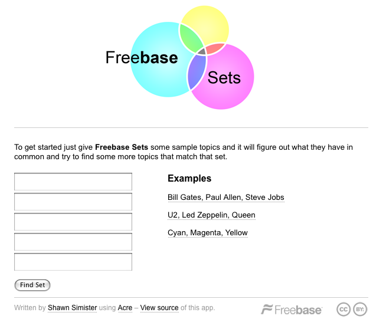

# How Did Freebase Sets Work?

At its core, Freebase Sets generated an MQL query which was then used to Query Freebase for a list of matching topics.

The user entered a number of entities to match using the Freebase Suggest autocomplete widget, so the input was a set of disambiguated MIDs instead of just text queries like Google Sets (the tool which inspired Freebase Sets).

The lookup process started by generating a query to lookup all relevant properties of the first two topics and then diffing the results to find the overlap. This could have been done via the Topic API but I generated some custom MQL read queries so that I could whitelist which predicates to consider and also blacklist some property values (eg. all topics have the type /type/object so that’s not a useful similarity. Also there are a lot /type/object/key values which can be ignored to make things more efficient).

At this point, we don’t yet know which properties are shared by all the topics so the MQL query had to mark each one as optional so that the query could return partially matching results.

Diffing the properties of each topic got a little more complicated when you took into account CVT properties. For example, two people may have worked for the same company but not during the same timeframe, or two people may have the same job title but at different companies. Allowing partial matches of a compound value (like employment) is important.

Once we know which properties the first two topics have in common, we can generate a new, much more specific, MQL query to see how the 3rd topic overlaps with only those properties instead of having to query all possible properties. Then you repeat the process by diffing the 3rd topic against the intersection of the 1st & 2nd topics and then use only the properties common to all 3 topics to further refine the query for the 4th topic and so on until you’ve diffed all the topics which the user has entered.

Ideally, you would want to diff the topics in order of smallest to largest (by total number of edges) so that you don’t have to compute needlessly large diffs in the first step but I don’t remember if I actually got around to implementing that.

At the end of the process, your MQL query should be filtered down to query only the properties which are common to all of the input topics. Now we can construct the final query by plugging in the concrete values for each property and making them required instead of optional. Also, instead of plugging in the MID of the topic we’re querying, we leave it as a wildcard, so we can get a list of all matching topics.
